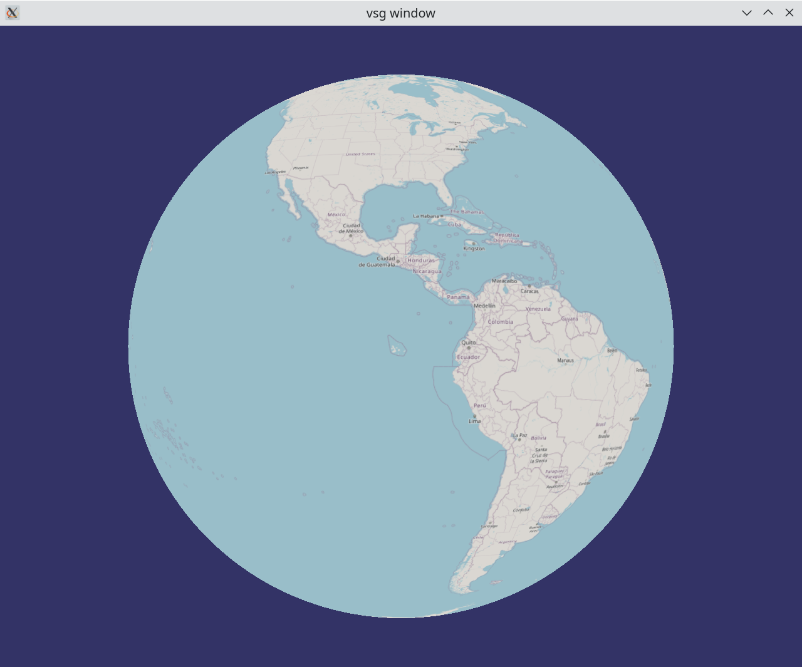

**The first draft of this chapter is now complete.  We'll make corrections and refine it over comming weeks.**

This chaper introduces developers to world of Vulkan, Scene Graphs, and how the VulkanSceneGraph combines these technologies to improve productivity and deliver high performance graphics and compute applications, takes you through downloading, building and install software and running the first exercise. The topic is broken down into the following sections:

1. [Low level APIs](LowLevelAPIs.md)
1. [Vulkan](Vulkan.md)
1. [High Level APIs](HighLevelAPIs.md)
1. [Development Principles](DevelopmentPrinciples.md)
1. [Performance Principles](PerformancePrinciples.md)
1. [VulkanSceneGraph Ecosystem](Ecosystem.md)
1. [VulkanSceneGraph Library](VulkanSceneGraphLibrary.md)
1. [Building the VulkanScenegraph projects](BuildingVulkanSceneGraph.md)
1. [Hello World](HelloWorld.md)

With completion of this chapter you will be able run the hellow world application:

---

<!--
With the final section of this chapter you will be able to run the hello world exercise:

---

Another attempt

---

<iframe width="420" height="315" src="https://www.youtube.com/watch?v=O0ONM_FcFPo" frameborder="0" allowfullscreen="allowfullscreen"> </iframe>

-->
